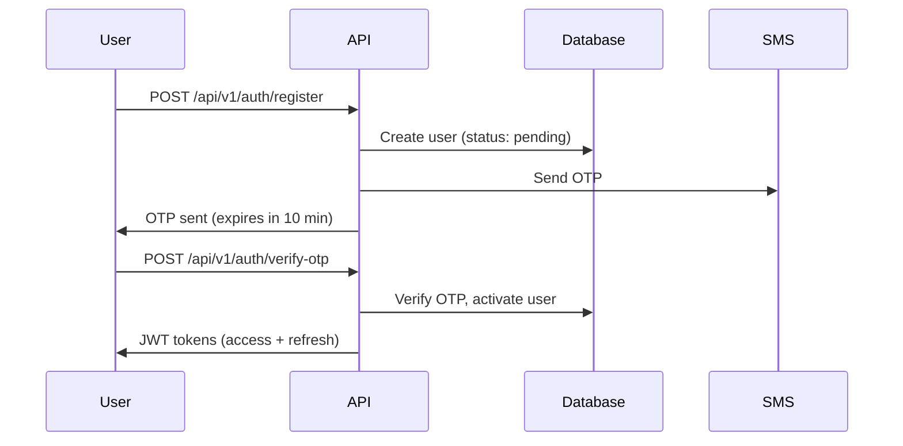

# API Documentation - ContractorConnect

**Base URL**: `http://localhost:8000` (Development)  
**Production URL**: `https://your-app.onrender.com` (When deployed)

**API Version**: v1  
**Authentication**: JWT Bearer Token

---

## 📖 Table of Contents

1. [Authentication Flow](#authentication-flow)
2. [API Endpoints](#api-endpoints)
3. [Authentication Endpoints](#authentication-endpoints)
4. [User Management Endpoints](#user-management-endpoints)
5. [Request/Response Examples](#requestresponse-examples)
6. [Error Handling](#error-handling)
7. [Rate Limiting](#rate-limiting)

---

## 🔐 Authentication Flow

### Registration Flow



### Login Flow

```
1. User provides phone number
2. System sends OTP
3. User verifies OTP
4. System returns JWT tokens
5. User includes token in subsequent requests
```

---

## 🚀 API Endpoints

### Base Endpoints

| Method | Endpoint | Description | Auth Required |
|--------|----------|-------------|---------------|
| GET | `/` | Root endpoint | No |
| GET | `/health` | Health check | No |
| GET | `/docs` | Swagger UI | No |
| GET | `/redoc` | ReDoc | No |

---

## 🔑 Authentication Endpoints

All authentication endpoints are under `/api/v1/auth`

### 1. Register New User

**Endpoint**: `POST /api/v1/auth/register`

**Description**: Register a new user and send OTP for verification

**Request Body**:
```json
{
  "phone_number": "+919876543210",
  "email": "contractor@example.com",
  "name": "John Doe",
  "role": "contractor",
  "city": "Mumbai",
  "state": "Maharashtra",
  "pincode": "400001",
  "description": "Experienced civil contractor with 10+ years"
}
```

**Required Fields**:
- `phone_number` (string): Phone with country code, format: +[country][number]
- `role` (string): Either "contractor" or "society"

**Optional Fields**:
- `email`, `name`, `city`, `state`, `pincode`, `description`, `address`

**Response** (201 Created):
```json
{
  "message": "User registered successfully. OTP sent for verification.",
  "phone_number": "+919876543210",
  "expires_in_minutes": 10,
  "user_id": 1
}
```

**Error Responses**:
- `400`: User already exists or validation error
- `422`: Invalid request format

---

### 2. Request Login OTP

**Endpoint**: `POST /api/v1/auth/login`

**Description**: Request OTP for login

**Request Body**:
```json
{
  "phone_number": "+919876543210",
  "purpose": "login"
}
```

**Response** (200 OK):
```json
{
  "message": "OTP sent successfully",
  "phone_number": "+919876543210",
  "expires_in_minutes": 10
}
```

**Error Responses**:
- `400`: User not found or too many requests (rate limited)
- `422`: Invalid phone format

**Rate Limiting**: Maximum 3 OTP requests per 5 minutes per phone number

---

### 3. Verify OTP and Login

**Endpoint**: `POST /api/v1/auth/verify-otp`

**Description**: Verify OTP code and receive JWT tokens

**Request Body**:
```json
{
  "phone_number": "+919876543210",
  "otp_code": "123456"
}
```

**Response** (200 OK):
```json
{
  "access_token": "eyJhbGciOiJIUzI1NiIsInR5cCI6IkpXVCJ9.eyJ1c2VyX2lkIjoxLCJwaG9uZV9udW1iZXIiOiIrOTE5ODc2NTQzMjEwIiwicm9sZSI6ImNvbnRyYWN0b3IiLCJleHAiOjE3MDM3NTcwMDB9...",
  "refresh_token": "eyJhbGciOiJIUzI1NiIsInR5cCI6IkpXVCJ9.eyJ1c2VyX2lkIjoxLCJwaG9uZV9udW1iZXIiOiIrOTE5ODc2NTQzMjEwIiwicm9sZSI6ImNvbnRyYWN0b3IiLCJ0eXBlIjoicmVmcmVzaCIsImV4cCI6MTcwNjM0OTAwMH0...",
  "token_type": "bearer",
  "expires_in": 1800
}
```

**Token Details**:
- `access_token`: Valid for 30 minutes, use for API requests
- `refresh_token`: Valid for 30 days, use to get new access token
- `expires_in`: Access token expiry in seconds

**Error Responses**:
- `400`: Invalid or expired OTP
- `422`: Validation error

**Usage**:
```bash
curl -H "Authorization: Bearer <access_token>" \
  http://localhost:8000/api/v1/auth/me
```

---

### 4. Refresh Access Token

**Endpoint**: `POST /api/v1/auth/refresh`

**Description**: Get new access token using refresh token

**Request Body**:
```json
{
  "refresh_token": "eyJhbGciOiJIUzI1NiIsInR5cCI6IkpXVCJ9..."
}
```

**Response** (200 OK):
```json
{
  "access_token": "eyJhbGciOiJIUzI1NiIsInR5cCI6IkpXVCJ9...",
  "token_type": "bearer",
  "expires_in": 1800
}
```

**Error Responses**:
- `401`: Invalid or expired refresh token

---

### 5. Get Current User

**Endpoint**: `GET /api/v1/auth/me`

**Description**: Get profile of currently authenticated user

**Headers**:
```
Authorization: Bearer <access_token>
```

**Response** (200 OK):
```json
{
  "id": 1,
  "phone_number": "+919876543210",
  "email": "contractor@example.com",
  "name": "John Doe",
  "role": "contractor",
  "status": "active",
  "profile_image": null,
  "description": "Experienced contractor",
  "address": "123 Main St",
  "city": "Mumbai",
  "state": "Maharashtra",
  "pincode": "400001",
  "is_verified": true,
  "is_active": true,
  "created_at": "2025-12-28T10:00:00",
  "updated_at": "2025-12-28T15:30:00",
  "last_login_at": "2025-12-28T15:30:00"
}
```

**Error Responses**:
- `401`: Not authenticated or token invalid
- `403`: Account deactivated

---

### 6. Logout

**Endpoint**: `POST /api/v1/auth/logout`

**Description**: Logout (client-side token deletion)

**Note**: Since JWT tokens are stateless, logout is handled client-side by deleting the tokens.

**Response** (200 OK):
```json
{
  "message": "Logged out successfully. Please delete tokens from client storage."
}
```

**Client Action Required**:
1. Delete `access_token` from storage
2. Delete `refresh_token` from storage
3. Clear any cached user data

---

## 👤 User Management Endpoints

All user endpoints are under `/api/v1/users` and require authentication.

### 1. Get User Profile

**Endpoint**: `GET /api/v1/users/profile`

**Headers**:
```
Authorization: Bearer <access_token>
```

**Response** (200 OK):
```json
{
  "id": 1,
  "phone_number": "+919876543210",
  "email": "contractor@example.com",
  "name": "John Doe",
  "role": "contractor",
  "status": "active",
  "profile_image": "https://example.com/image.jpg",
  "description": "Experienced civil contractor",
  "address": "123 Main St",
  "city": "Mumbai",
  "state": "Maharashtra",
  "pincode": "400001",
  "is_verified": true,
  "is_active": true,
  "created_at": "2025-12-28T10:00:00",
  "updated_at": "2025-12-28T15:30:00",
  "last_login_at": "2025-12-28T15:30:00"
}
```

---

### 2. Update User Profile

**Endpoint**: `PUT /api/v1/users/profile`

**Headers**:
```
Authorization: Bearer <access_token>
```

**Request Body** (all fields optional):
```json
{
  "name": "John Doe Updated",
  "email": "newemail@example.com",
  "address": "456 New Street",
  "city": "Delhi",
  "state": "Delhi",
  "pincode": "110001",
  "description": "Updated experience and skills",
  "profile_image": "https://example.com/newimage.jpg"
}
```

**Note**: Cannot update `phone_number` or `role`

**Response** (200 OK):
```json
{
  "id": 1,
  "phone_number": "+919876543210",
  "email": "newemail@example.com",
  "name": "John Doe Updated",
  "role": "contractor",
  "status": "active",
  "city": "Delhi",
  "is_verified": true,
  "is_active": true,
  ...
}
```

**Error Responses**:
- `400`: Email already in use
- `401`: Not authenticated
- `422`: Validation error

---

### 3. Get User by ID

**Endpoint**: `GET /api/v1/users/{user_id}`

**Headers**:
```
Authorization: Bearer <access_token>
```

**Response** (200 OK):
```json
{
  "id": 1,
  "phone_number": "+91**********",
  "name": "John Doe",
  "role": "contractor",
  "status": "active",
  "profile_image": "https://example.com/image.jpg",
  "description": "Experienced contractor",
  "city": "Mumbai",
  "state": "Maharashtra",
  "is_verified": true,
  "is_active": true,
  "created_at": "2025-12-28T10:00:00",
  "last_login_at": "2025-12-28T15:30:00"
}
```

**Note**: Returns public information only (sensitive data hidden)

**Error Responses**:
- `404`: User not found
- `401`: Not authenticated

---

### 4. Deactivate Account

**Endpoint**: `DELETE /api/v1/users/account`

**Headers**:
```
Authorization: Bearer <access_token>
```

**Description**: Soft delete (deactivate) current user's account

**Response** (200 OK):
```json
{
  "message": "Account deactivated successfully"
}
```

**Note**: 
- This is a soft delete - data is preserved
- User can no longer login
- Contact support to reactivate

---

## ⚠️ Error Handling

All errors follow this format:

```json
{
  "detail": "Error message description"
}
```

### Common HTTP Status Codes

| Code | Description | Common Causes |
|------|-------------|---------------|
| 200 | OK | Successful request |
| 201 | Created | Resource created successfully |
| 400 | Bad Request | Invalid data or business logic error |
| 401 | Unauthorized | Missing or invalid token |
| 403 | Forbidden | Insufficient permissions |
| 404 | Not Found | Resource doesn't exist |
| 422 | Validation Error | Request body validation failed |
| 429 | Too Many Requests | Rate limit exceeded |
| 500 | Internal Server Error | Server error |

### Example Error Response

```json
{
  "detail": "User with this phone number already exists"
}
```

---

## 🚦 Rate Limiting

### OTP Requests
- **Limit**: 3 requests per 5 minutes per phone number
- **Purpose**: Prevent SMS abuse
- **Response**: `400 Bad Request` with message "Too many OTP requests"

### Future Rate Limits
- API requests: 100 requests per minute per user
- File uploads: 10 uploads per hour

---

## 🧪 Testing with Swagger UI

1. **Open Swagger UI**: http://localhost:8000/docs
2. **Register**: Use `/api/v1/auth/register` endpoint
3. **Check Terminal**: OTP will be printed (for development)
4. **Verify OTP**: Use `/api/v1/auth/verify-otp` with the OTP
5. **Authorize**: Click "Authorize" button, enter token
6. **Test Endpoints**: Try protected endpoints

---

## 📱 Mobile App Integration

### React Native Example

```javascript
// Register
const register = async (userData) => {
  const response = await fetch('http://api.example.com/api/v1/auth/register', {
    method: 'POST',
    headers: { 'Content-Type': 'application/json' },
    body: JSON.stringify(userData)
  });
  return await response.json();
};

// Verify OTP and Login
const verifyOTP = async (phone, otp) => {
  const response = await fetch('http://api.example.com/api/v1/auth/verify-otp', {
    method: 'POST',
    headers: { 'Content-Type': 'application/json' },
    body: JSON.stringify({ phone_number: phone, otp_code: otp })
  });
  const data = await response.json();
  
  // Store tokens
  await AsyncStorage.setItem('access_token', data.access_token);
  await AsyncStorage.setItem('refresh_token', data.refresh_token);
  
  return data;
};

// Make authenticated request
const getProfile = async () => {
  const token = await AsyncStorage.getItem('access_token');
  const response = await fetch('http://api.example.com/api/v1/users/profile', {
    headers: { 'Authorization': `Bearer ${token}` }
  });
  return await response.json();
};
```

---

## 🔍 Next Steps

**Coming Soon**:
- Request Management API (create, browse, manage requests)
- Bidding System API (contractors bid on requests)
- File Upload API (images, documents)
- Notifications API (push notifications)
- Admin API (user management, analytics)

---

**Last Updated**: December 28, 2025  
**API Version**: 1.0.0  
**Documentation**: Auto-generated with FastAPI OpenAPI
